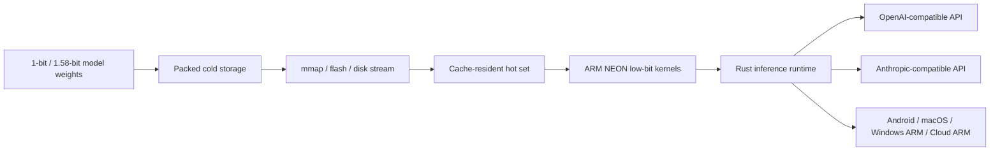
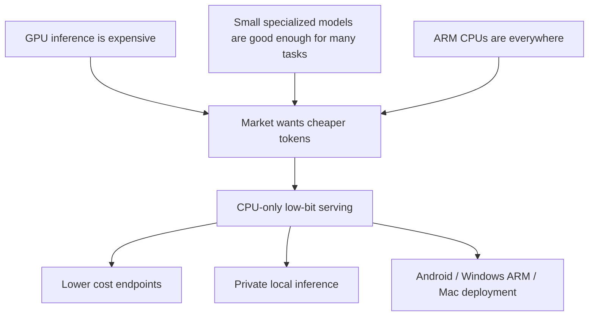
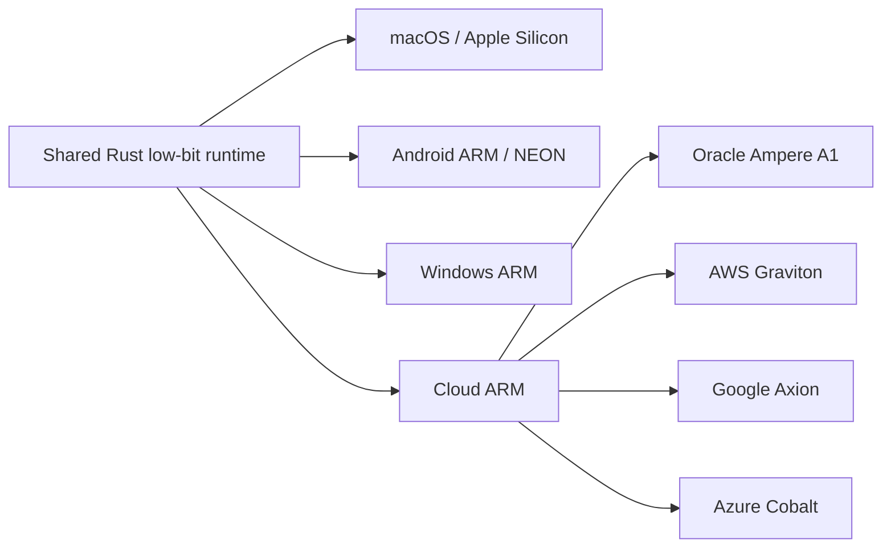
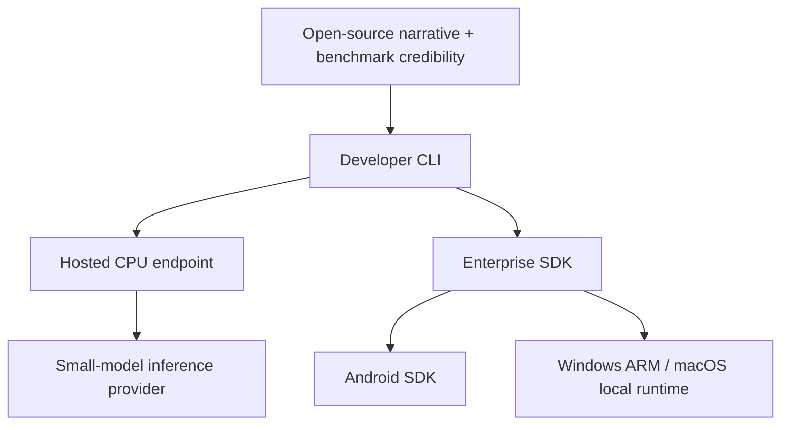
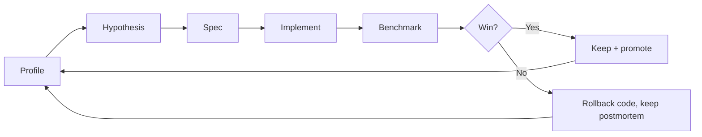

# sram_attention

**Cache-resident AI inference for small low-bit models. Useful tokens without GPUs.**

This is the public story repo for `sram_attention`: a Rust runtime strategy for
running 1-bit / 1.58-bit LLMs on ordinary ARM CPUs by treating the memory
hierarchy as the accelerator.

This repository intentionally contains **no source code, no model weights, and
no private benchmark artifacts**. It exists for investors, accelerator
applications, technical partners, and early design customers.

## The One-Liner

We make small 1-bit / 1.58-bit models run fast on ordinary ARM CPUs, using
cache residency instead of GPUs.

## Why Now

Three things changed at the same time:

1. **Low-bit models became real.** BitNet b1.58 and Bonsai-style models make
   1-bit / 1.58-bit inference credible.
2. **The bottleneck moved.** With tiny weights, the hard problem is no longer
   only FLOPS. It is cache locality, bit decode, hot working set control,
   thread scheduling, and memory movement.
3. **ARM is everywhere.** Apple Silicon, Android, Windows ARM, AWS Graviton,
   Google Axion, Azure Cobalt, and Oracle Ampere all create a large non-GPU
   deployment surface.

## What We Build

`sram_attention` targets two model families:

| Family | Why it matters |
|---|---|
| **MS BitNet b1.58** | Public low-bit ecosystem and CPU-first reference point |
| **Bonsai-style 1-bit / g128** | Large low-bit local model path with aggressive cache-residency experiments |

## Core Insight

Most inference stacks optimize this path:

We optimize this path:

The goal is not to beat GPUs on every workload. The goal is sharper: serve
small specialized models at useful speed on CPUs that are much cheaper and more
widely available than GPUs.

## Current Proof Points

Measured internal project results:

| Path | Result | Notes |
|---|---:|---|
| MS BitNet Rust REST path | ~60.9 tok/s warm 16-token generation | Apple M3 Pro class hardware |
| Bonsai Rust REST path | ~40.3 tok/s generation | Within 1% of direct benchmark |
| Bonsai direct path | ~42 tok/s class | Exact-checksum benchmark lane |
| Oracle A1 synthetic projection | ~5.9-6.3 tok/s | MS-BitNet-shaped model-free ARM cloud probe |
| Original MS BitNet comparison | ~2-3x faster in reproduced local lane | Same local development class |

The important point is not a single benchmark trophy. The important point is
that CPU-only low-bit inference is already fast enough to become a product
category for small models.

## Why Investors Should Care

The wedge is **cost-effective inference for small models**:

- support replies;
- extraction;
- query rewrite;
- routing;
- summarization;
- RAG follow-up;
- local/private assistant commands;
- deterministic task agents.

Many of these do not need a frontier GPU model. They need a cheap, fast,
resident small model.

## Platform Story

The same architectural bet applies across platforms:

| Platform | Market role | Why it matters |
|---|---|---|
| macOS / Apple Silicon | Development and prosumer deployment | Strong CPU cache hierarchy, easy demos |
| Android | Long-term distribution | Billions of devices, fragmented NPU landscape |
| Windows ARM | New laptop market | Snapdragon X-class machines create CPU-only demand |
| Cloud ARM | First commercial wedge | Cheap endpoints without GPU reservation |

## Product Shape

Initial product:

- Rust REST server;
- OpenAI-compatible `/v1/chat/completions`;
- Anthropic-compatible `/v1/messages`;
- one low-bit model per process;
- startup autotune by platform;
- deterministic greedy serving first;
- public benchmark dashboard later.

## Why We Are Different

| Alternative | Strength | Gap |
|---|---|---|
| GPU inference providers | Peak throughput | Expensive for small always-on workloads |
| Vendor NPUs | Device acceleration | Fragmented SDKs and hardware-specific deployment |
| Generic CPU runtimes | Broad ecosystem | Not specialized for cache-resident 1-bit / 1.58-bit inference |
| Original BitNet stacks | Reference ecosystem | Room for runtime and system-level optimization |

`sram_attention` is specialized. It is not trying to be every model runtime. It
is trying to be the best CPU path for useful small low-bit models.

## Engineering Discipline

The private engineering repo uses spec-driven optimization:

Every serious optimization is a measured experiment with:

- a written hypothesis;
- a bounded implementation scope;
- acceptance criteria;
- benchmark commands;
- keep/reject decision;
- postmortem for failed ideas.

See [specs/](specs/) for public sanitized examples of this process.

## Repository Map

- [docs/investor-one-pager.md](docs/investor-one-pager.md)
- [docs/market-fit.md](docs/market-fit.md)
- [docs/go-to-market.md](docs/go-to-market.md)
- [docs/accelerator-application.md](docs/accelerator-application.md)
- [docs/platform-strategy.md](docs/platform-strategy.md)
- [docs/benchmark-story.md](docs/benchmark-story.md)
- [docs/sources.md](docs/sources.md)
- [docs/faq.md](docs/faq.md)
- [specs/README.md](specs/README.md)

## Status

This public repo is for visibility and fundraising. The engineering repository
is separate.

Current stage:

- technical prototype exists;
- MS BitNet and Bonsai lanes exist;
- REST integration exists;
- cloud ARM platform probing has started;
- Android and production hosted serving are next.

## Contact

Open an issue for investor, accelerator, technical partner, or early design
customer conversations.
