# sram_attention

**Cache-resident AI inference for small low-bit models. Useful tokens without GPUs.**

This is the public story repo for `sram_attention`: a Rust runtime strategy for
running 1-bit / 1.58-bit LLMs on ordinary ARM CPUs by treating the memory
hierarchy as the accelerator.

This repository intentionally contains **no source code, no model weights, and
no private benchmark artifacts**. It exists for investors, accelerator
applications, technical partners, and early design customers.

For a concise investor-facing status page, start here:
[docs/public-landing.md](docs/public-landing.md).

## The One-Liner

We make small 1-bit / 1.58-bit models run fast on ordinary ARM CPUs, using
cache residency instead of GPUs.

## Why Now

Three things changed at the same time:

1. **Low-bit models became real.** BitNet b1.58 and Bonsai-style models make
   1-bit / 1.58-bit inference credible.
2. **The bottleneck moved.** With tiny weights, the hard problem is no longer
   only FLOPS. It is cache locality, bit decode, hot working set control,
   thread scheduling, and memory movement.
3. **ARM is everywhere.** Apple Silicon, Android, Windows ARM, AWS Graviton,
   Google Axion, Azure Cobalt, and Oracle Ampere all create a large non-GPU
   deployment surface.

## What We Build

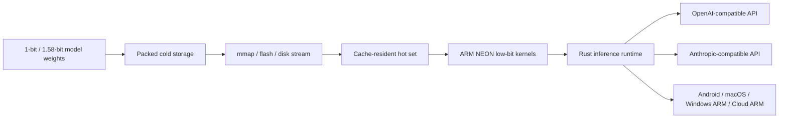

`sram_attention` now has four active model families in one champion race:

| Family | Why it matters |
|---|---|
| **MS BitNet b1.58** | Public low-bit ecosystem and CPU-first reference point |
| **Bonsai-style 1-bit / g128** | Large low-bit local model path with aggressive cache-residency experiments |
| **Falcon3 native 1.58-bit** | Open native ternary GGUF family with strong CPU-only speed and 1B/3B/7B/10B scaling path |
| **ModernBERT Diff 1.58-bit** | Diffusion-style low-bit experiment for block generation and cache-resident repeated denoise loops |

## The Champion Race

The newest result is not only another benchmark. It is evidence that the runtime
has become an optimization system where models help each other.

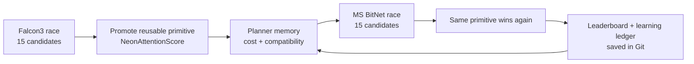

In plain English: an acceleration primitive discovered on Falcon3 was proposed
by the planner for MS BitNet, benchmarked in a separate synchronized `5 x 3`
race, and won there too.

| Model | Baseline | Winning transferred plan | Result |
|---|---:|---|---:|
| Falcon3-1B native 1.58-bit | 71.870 tok/s | `attention-score-neon-on` | 76.924 tok/s, +7.03% |
| MS BitNet b1.58 | 42.216 tok/s | `attention-score-neon-on` | 45.345 tok/s, +7.41% |

That is the product moat in miniature. We are not hand-tuning one model. We are
building a dictionary of reusable low-bit inference primitives, measuring their
price on real hardware, and letting the planner compose them across model
families.

The failed transfers matter too. The same MS BitNet race showed that per-tensor
I8 activation, wider lm_head row shapes, and the F32 coherence fallback were
regressions. Those failures are kept as planner memory, not thrown away as
tribal knowledge.

### Alpha Mutant Method

The champion race now has a second lane: not only "pick the best known plan",
but "mutate the champions and see whether the theory missed something." We call
this the Alpha Mutant method.

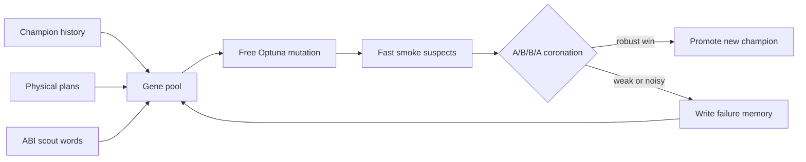

Why this matters: a deterministic planner eventually becomes conservative. It
keeps proposing what its current theory already understands. The Alpha Mutant
lane is allowed to be stranger. It recombines winners, rejected candidates, and
new primitive words, then lets hardware decide.

The guardrail is just as important as the hunt:

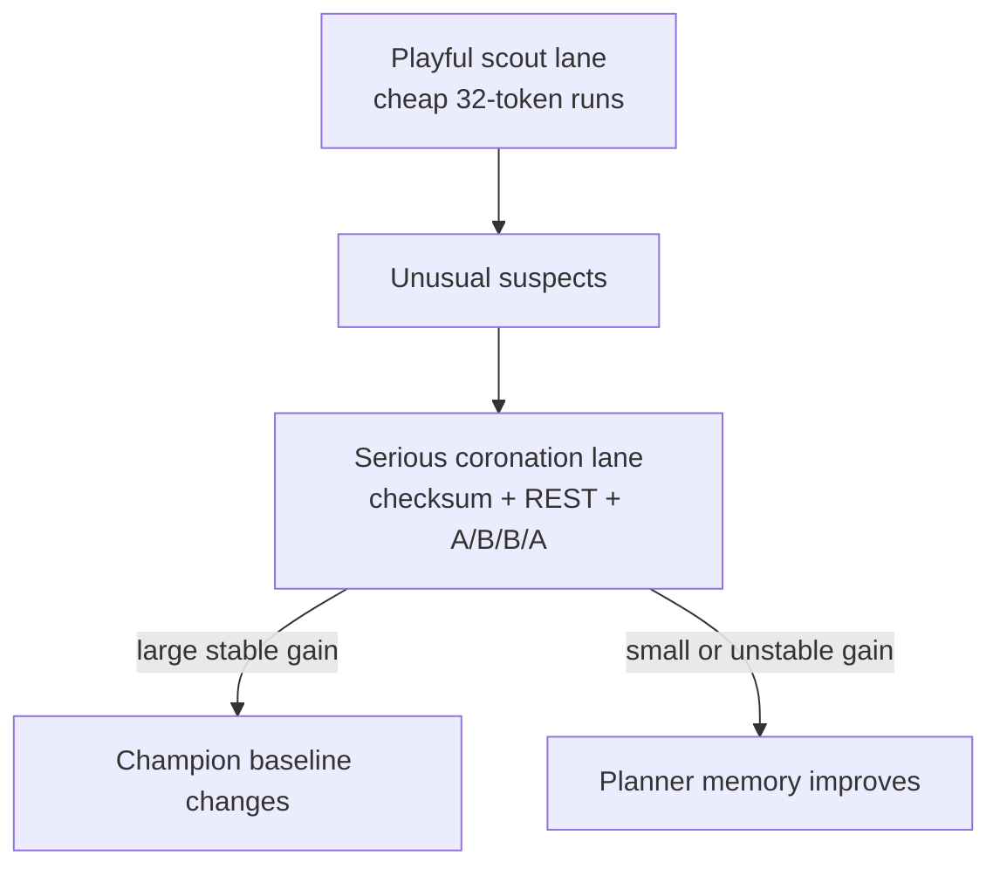

Recent Falcon3 example:

| Step | Result | Interpretation |
|---|---:|---|
| Free Optuna smoke run | found `79.310 tok/s` and `79.126 tok/s` suspects | Interesting neighborhood |
| Reciprocal A/B/B/A at longer shape | only `+0.233%` and `+0.471%` mean deltas | Not enough to promote |
| Final decision | champion stayed unbeaten | Method worked: curiosity without self-deception |

That discipline is investor-relevant. The system can explore aggressively, but
it only turns a result into a default after a repeatable full-path gate. Wins
become reusable primitives. Losses become searchable memory. Both make the next
race better.

### Horizontal Gene Transfer

The same primitive dictionary should not be trapped inside LLM inference. The
next experiment borrows a biological idea: horizontal gene transfer. A useful
acceleration "gene" can jump into another organism.

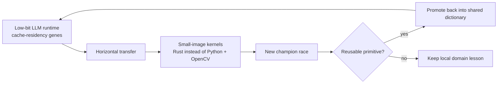

The first foreign host is small image processing on weak ARM CPUs: decode a
compact JPEG, keep the working set hot, and replace a narrow Python/OpenCV path
with a low-level Rust implementation. Many of the same words apply:

| Cache-residency gene | Image-domain form |
|---|---|
| Packed layout | cache-line aligned RGB/Lab/gray tiles |
| Elementwise LUT | color transforms, gamma tables, threshold maps |
| Fast aggregation | Otsu histograms, radial statistics, min/max reductions |
| Runtime autotune | tile shape, thread count, storage/preload mode |
| Champion gate | golden-output comparison against the old pipeline |

This matters commercially because it turns the runtime from "one fast model
server" into a reusable optimization method for CPU-bound edge workloads. The
same race discipline can harden medical-device image preprocessing, local
document extraction, sensor pipelines, and other small-data tasks where Python
is convenient but too heavy.

## Core Insight

Most inference stacks optimize this path:

We optimize this path:

The goal is not to beat GPUs on every workload. The goal is sharper: serve
small specialized models at useful speed on CPUs that are much cheaper and more
widely available than GPUs.

## Current Proof Points

Measured internal project results:

| Path | Result | Notes |
|---|---:|---|
| MS BitNet Rust REST path | ~60.9 tok/s warm 16-token generation | Apple M3 Pro class hardware |
| Bonsai Rust REST path | ~40.3 tok/s generation | Within 1% of direct benchmark |
| Bonsai direct path | ~42 tok/s class | Exact-checksum benchmark lane |
| Falcon3-1B native 1.58-bit Rust REST | ~96.9-100.6 tok/s warm generation | Apple M3 Pro CPU-only, no GPU |
| Falcon3-3B native 1.58-bit Rust REST | ~56.8 tok/s warm generation | Apple M3 Pro CPU-only, size-scaling lane |
| Falcon3-1B native 1.58-bit Rust REST on Oracle A1 | ~30.2 tok/s warm generation | Full model on ARM cloud free-tier, best profile uses 3 Neoverse-N1 worker threads |
| Falcon3-1B native 1.58-bit Rust REST on Google Cloud C4A/Axion | ~44.0 tok/s warm generation | Full model on 2 vCPU Neoverse-V2, 4 GiB RAM, 80 MB shared L3 |
| Google Cloud C4A/Axion model sweep | MS BitNet 2B ~20.6 tok/s; Falcon3 3B ~24.4; 7B ~10.9; 10B ~8.2 | Same Rust REST runtime on one low-cost ARM VM |
| Google Cloud N4A recertification | Falcon3-1B ~30.7 tok/s | Newer Neoverse-N3 and 112 MB L3 tested; C4A remains faster for current kernels |
| ModernBERT Diff Rust REST | ~26 tok/s one-mask fixture, ~88.8 effective tok/s normalized cycle | PyTorch removed from inference path |
| Original MS BitNet comparison | ~2-3x faster in reproduced local lane | Same local development class |

The important point is not a single benchmark trophy. The important point is
that CPU-only low-bit inference is already fast enough to become a product
category for small models. The cloud ARM results are especially important:
Oracle A1 and Google Cloud C4A/Axion are different providers and different ARM
server generations, yet both can run the same native 1.58-bit Rust REST path at
practical slow-agent speed for overnight tasks, triage, summarization, routing,
and background code-assistant workflows.

The champion-race result adds a second proof point: improvements are portable.
Falcon3 and MS BitNet now share an optimization loop, so every new primitive can
be tested as a cross-model asset instead of a one-off patch.

### Unit Economics Snapshot

Assuming continuous full-load generation for 30 days
(`2,592,000 seconds/month`) and counting generated tokens:

| Provider / model | Monthly VM cost | Throughput | Generated tokens/month | Cost / 1M generated tokens |
|---|---:|---:|---:|---:|
| Oracle A1 free-tier / Falcon3-1B | €0 | ~30.2 tok/s | ~78.3M | €0.00 |
| Google Cloud C4A spot / Falcon3-1B | ~€12/mo | ~44.0 tok/s | ~114.0M | ~€0.105 |
| Google Cloud C4A spot / MS BitNet 2B | ~€12/mo | ~20.6 tok/s | ~53.4M | ~€0.225 |
| Google Cloud C4A spot / Falcon3-3B | ~€12/mo | ~24.4 tok/s | ~63.2M | ~€0.190 |
| Google Cloud C4A spot / Falcon3-7B | ~€12/mo | ~10.9 tok/s | ~28.3M | ~€0.425 |
| Google Cloud C4A spot / Falcon3-10B | ~€12/mo | ~8.2 tok/s | ~21.3M | ~€0.565 |
| Google Cloud N4A spot / Falcon3-1B | ~€12/mo | ~30.7 tok/s | ~79.7M | ~€0.151 |

The commercial headline is simple: a saturated low-cost Google ARM spot VM can
already put Falcon3-1B near **ten euro-cents per million generated tokens**
before storage, network, uptime, and margin. Oracle's free tier is a zero-cost
experimentation lane and a useful slow-agent baseline. N4A was also tested; it
is usable, but C4A is currently the better Google ARM SKU for this runtime.

## Why Investors Should Care

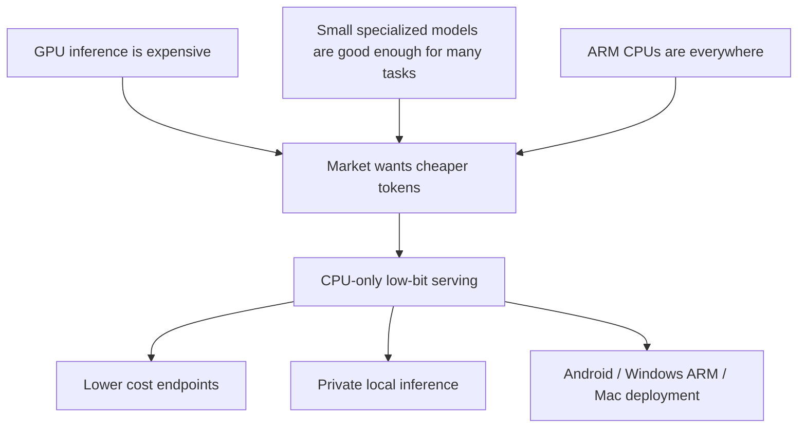

The wedge is **cost-effective inference for small models**:

- support replies;
- extraction;
- query rewrite;
- routing;
- summarization;
- RAG follow-up;
- local/private assistant commands;
- deterministic task agents.

Many of these do not need a frontier GPU model. They need a cheap, fast,
resident small model.

The deeper wedge is an optimization flywheel:

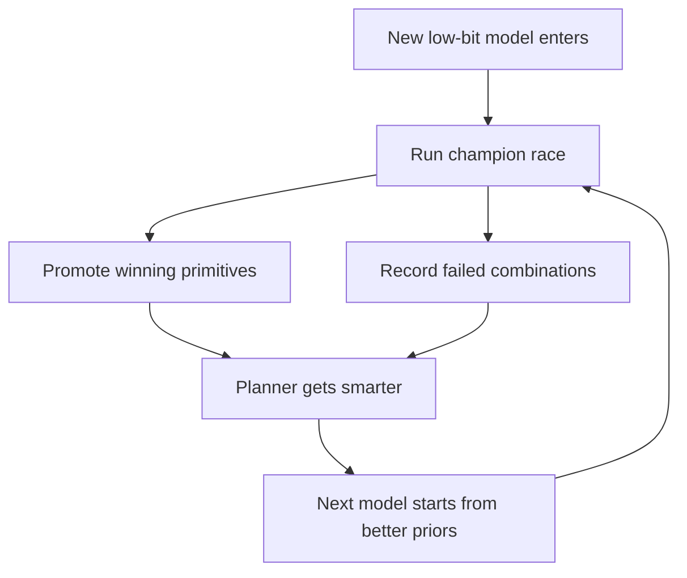

Each supported model increases the value of the runtime for the next model. This
is closer to a low-bit inference compiler than a normal model server.

## Platform Story

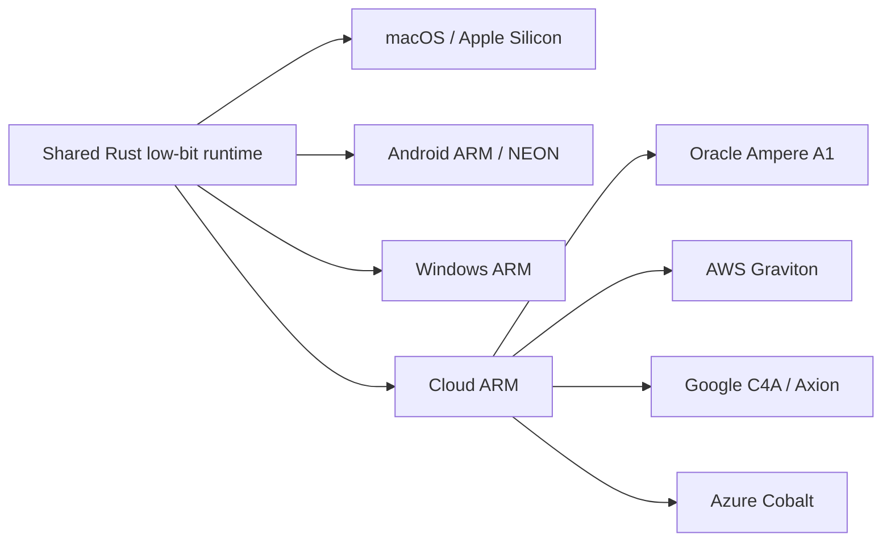

The same architectural bet applies across platforms:

| Platform | Market role | Why it matters |
|---|---|---|
| macOS / Apple Silicon | Development and prosumer deployment | Strong CPU cache hierarchy, easy demos |
| Android | Long-term distribution | Billions of devices, fragmented NPU landscape |
| Windows ARM | New laptop market | Snapdragon X-class machines create CPU-only demand |
| Cloud ARM | First commercial wedge | Oracle and Google ARM full-model results now exist; cheap endpoints without GPU reservation |

## Product Shape

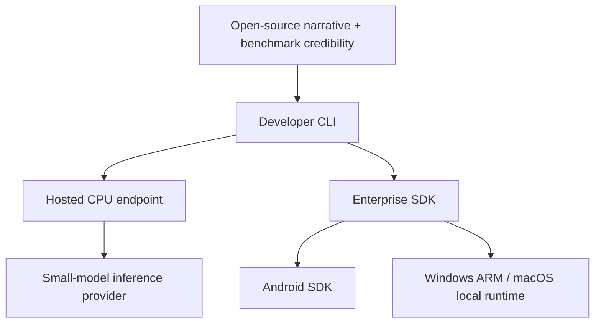

Initial product:

- Rust REST server;
- OpenAI-compatible `/v1/chat/completions`;
- Anthropic-compatible `/v1/messages`;
- one low-bit model per process;
- startup autotune by platform;
- cloud ARM serving profiles for cheap always-on endpoints;
- deterministic greedy serving first;
- public benchmark dashboard later.

## Why We Are Different

| Alternative | Strength | Gap |
|---|---|---|
| GPU inference providers | Peak throughput | Expensive for small always-on workloads |
| Vendor NPUs | Device acceleration | Fragmented SDKs and hardware-specific deployment |
| Generic CPU runtimes | Broad ecosystem | Not specialized for cache-resident 1-bit / 1.58-bit inference |
| Original BitNet stacks | Reference ecosystem | Room for runtime and system-level optimization |

`sram_attention` is specialized. It is not trying to be every model runtime. It
is trying to be the best CPU path for useful small low-bit models.

## Why This Is Production-Relevant Now

The current runtime is still an engineering prototype, but the throughput class
has crossed a practical threshold:

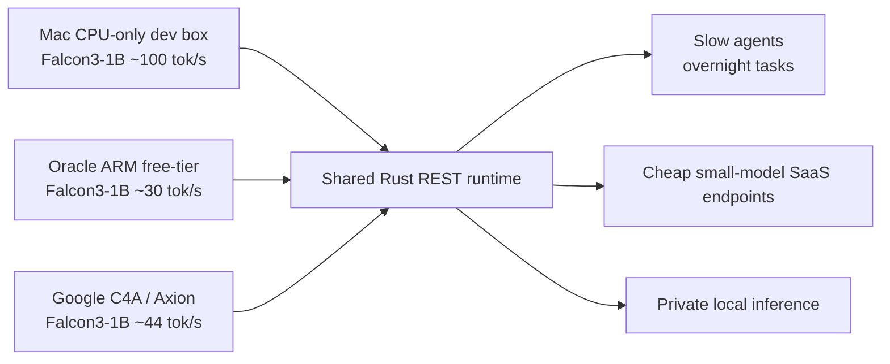

For many production tasks, the requirement is not "frontier model at maximum
quality." It is:

- always-on;
- private or cheap;
- deterministic;
- good enough for narrow work;
- easy to deploy next to existing services.

At `~30-44 tok/s` on low-cost ARM cloud VMs and `~100 tok/s` on a laptop CPU, native
1.58-bit models are no longer only demos. They are viable for production
background work where latency budgets are seconds, not milliseconds.

## Engineering Discipline

The private engineering repo uses spec-driven optimization:

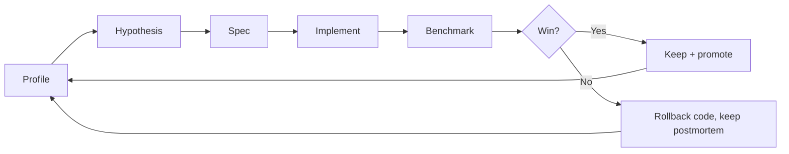

Every serious optimization is a measured experiment with:

- a written hypothesis;
- a bounded implementation scope;
- acceptance criteria;
- benchmark commands;
- keep/reject decision;
- postmortem for failed ideas.

See [specs/](specs/) for public sanitized examples of this process.

## Repository Map

- [docs/investor-one-pager.md](docs/investor-one-pager.md)
- [docs/market-fit.md](docs/market-fit.md)
- [docs/go-to-market.md](docs/go-to-market.md)
- [docs/accelerator-application.md](docs/accelerator-application.md)
- [docs/platform-strategy.md](docs/platform-strategy.md)
- [docs/benchmark-story.md](docs/benchmark-story.md)
- [docs/sources.md](docs/sources.md)
- [docs/faq.md](docs/faq.md)
- [specs/README.md](specs/README.md)

## Status

This public repo is for visibility and fundraising. The engineering repository
is separate.

Current stage:

- technical prototype exists;
- MS BitNet, Bonsai, Falcon3, and ModernBERT Diff lanes exist;
- REST integration exists;
- cloud ARM full-model Falcon3 baselines exist on two providers:
  - Oracle A1 at ~30 tok/s;
  - Google Cloud C4A/Axion at ~44 tok/s;
- platform autotune has found real profile differences, such as 3 worker
  threads beating 4 on Oracle A1 while Google C4A prefers its visible 2 vCPUs;
- N4A spot recertification proved that newer ARM generation and larger L3 do not
  automatically win; benchmarked profile selection matters;
- text-generation quality is now tracked separately from raw token-id/full-path
  speed; the current cloud runs prove launchability and throughput, while the
  next gate fixes tokenizer/template/sampler parity;
- Android and production hosted serving are next.

## Contact

Open an issue for investor, accelerator, technical partner, or early design
customer conversations.
