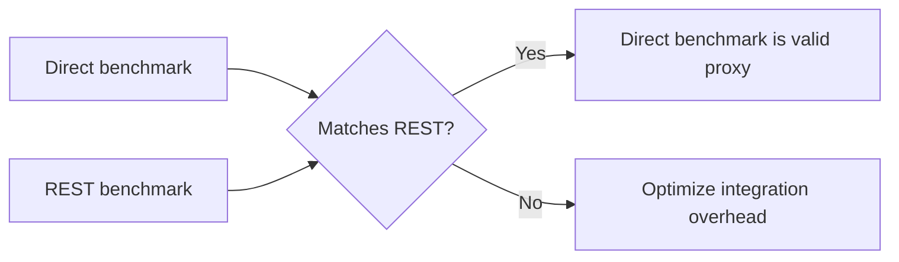

# Benchmark Story

## What We Measure

We separate four benchmark classes:

| Class | Purpose |
|---|---|
| Microbench | Isolate one kernel or projection |
| Synthetic startup probe | Choose platform defaults without model files |
| Direct full-loop benchmark | Measure generation without HTTP noise |
| REST integration benchmark | Measure product-shaped request path |

This prevents fake wins. A kernel win that disappears in REST is not a product
win.

## Current Highlights

| Benchmark | Current story |
|---|---|
| MS BitNet REST | Warm 16-token generation around 60+ tok/s on Apple M3 Pro class hardware |
| Bonsai REST | Around 40 tok/s generation, within 1% of direct loop |
| Oracle A1 synthetic | MS-BitNet-shaped projection around 5.9-6.3 tok/s without model files |

## Benchmark Discipline

The engineering rule: if the product-shaped REST path is slower than the direct
path by more than the threshold, future performance claims must include both
numbers.

## Next Public Benchmarks

1. Full MS BitNet model on Oracle A1.
2. Full MS BitNet model on AWS Graviton.
3. Full MS BitNet model on Google Axion.
4. Full MS BitNet model on Azure Cobalt.
5. Android flagship synthetic and full-model runs.
6. Cost per 1M generated tokens vs GPU endpoints.

