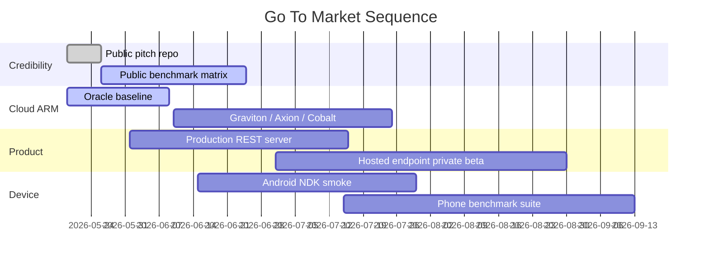

# Go To Market

## Strategic Wedge

Start with a hosted or self-hosted **CPU-only endpoint for small low-bit
models**. Expand into Android and Windows ARM once public benchmarks are ready.

## GTM Sequence

## Phase 1: Credibility

Goal: make the story legible and measurable.

Deliverables:

- public pitch repo;
- one-page investor brief;
- benchmark methodology;
- sanitized spec examples;
- public cloud ARM plan.

Success metric:

- investors and technical partners understand the category in under five
  minutes.

## Phase 2: Cloud ARM Beta

Goal: prove useful tokens per dollar without GPUs.

Targets:

- Oracle Ampere A1;
- AWS Graviton;
- Google Axion;
- Azure Cobalt.

Deliverables:

- model-free synthetic startup benchmark;
- full-model BitNet benchmark;
- provider comparison table;
- OpenAI-compatible endpoint;
- cost-per-1M-tokens estimate.

Success metric:

- a small model endpoint that is meaningfully cheaper than GPU-backed serving
  for deterministic workloads.

## Phase 3: Developer Product

Goal: make it easy to try.

Deliverables:

- binary release for macOS arm64;
- Linux ARM server binary;
- Windows ARM build;
- Docker image where useful;
- API examples;
- benchmark command cookbook.

Success metric:

- developer can run a local endpoint in under 10 minutes after downloading a
  model.

## Phase 4: Android SDK

Goal: prove the device story.

Deliverables:

- Android NDK library;
- Kotlin wrapper;
- reference app;
- Snapdragon and Dimensity benchmark table;
- thermal-stable runs.

Success metric:

- a small low-bit model reaches interactive speed on flagship Android hardware
  without NPU-specific code.

## Channels

- GitHub visibility;
- accelerator applications;
- founder/investor demo videos;
- benchmark blog posts;
- Hacker News / Lobsters technical writeups;
- ARM / cloud provider startup programs;
- model-team partnerships;
- Android developer communities.

## Sales Motion

### Early design partners

Offer:

- free technical evaluation;
- customer workload benchmark;
- private endpoint or local binary;
- feedback loop on model and prompt quality.

### Paid pilots

Offer:

- fixed-fee optimization pass;
- cost comparison against current provider;
- private deployment support;
- benchmark report.

### Product pricing

Likely packages:

- hosted endpoint per 1M tokens;
- enterprise runtime license;
- Android SDK license;
- model/hardware optimization services.

