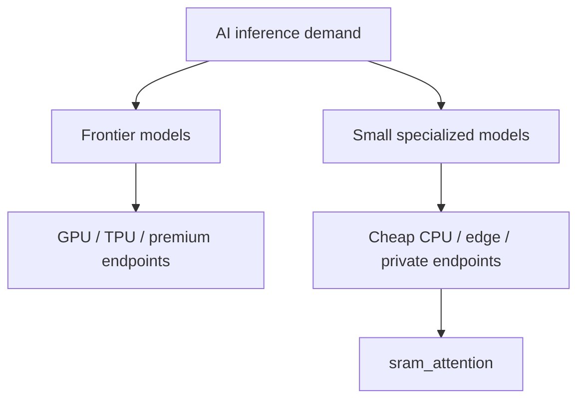

# Market Fit

## Best Initial Market

The strongest first market is **cloud ARM small-model serving**.

Why:

- shorter path to revenue than Android distribution;
- clear buyer pain around GPU endpoint cost;
- easier deployment than mobile SDKs;
- measurable cost-per-token story;
- compatible with OpenAI-style APIs customers already know.

## Market Fit Score

| Segment | Fit | Notes |
|---|---:|---|
| Cloud ARM small-model serving | 8/10 | Best wedge: cheap tokens without GPUs |
| Mac / Windows ARM local runtime | 7/10 | Strong developer and privacy story |
| Android on-device SDK | 6/10 now, 8/10 later | Huge market, but thermal and distribution work remains |
| Replacing all GPU inference | 3/10 | Wrong positioning |
| Cheap provider of small models | 8/10 | Right positioning |

## Ideal Customer Profile

### First ICP: AI startups with many small inference calls

They use models for:

- routing;
- classification;
- extraction;
- query rewrite;
- summarization;
- lightweight support responses.

They do not need a frontier model for every call, but they still pay frontier
or GPU-backed prices too often.

### Second ICP: enterprise private inference

They want:

- local/private deployment;
- no GPU cluster;
- no CUDA operational burden;
- OpenAI-compatible API;
- predictable cost.

### Third ICP: device and app teams

They want:

- offline mode;
- privacy;
- no vendor NPU lock-in;
- Android and Windows ARM portability.

## Buying Trigger

The buyer says one of these:

- "Our GPU bill is too high for simple model calls."
- "We need a private local model for regulated workflows."
- "We want OpenAI-compatible endpoints on cheap hardware."
- "We need an Android local model but cannot depend on one NPU SDK."
- "We need deterministic low-latency small-model responses."

## What Not To Sell

Do not sell:

- "We replace all GPUs."
- "We beat frontier model quality."
- "We are a general-purpose runtime for every quant format."

Sell:

- "Cheap useful tokens."
- "CPU-only small-model inference."
- "Portable ARM deployment."
- "Cache-resident low-bit runtime."

## Market Narrative

The market is splitting:

Frontier models keep winning high-complexity reasoning. Small specialized
models win volume tasks. `sram_attention` is built for the second branch.

