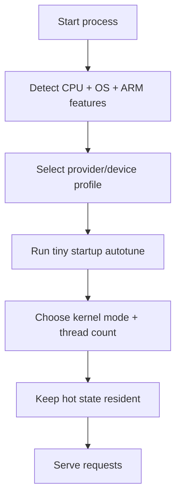

# Platform Strategy

## Platform Goal

One low-bit runtime, tuned per host:

## Profiles

| Profile | Target |
|---|---|
| `auto` | Default detection |
| `oracle-a1` | Oracle Ampere A1 / Neoverse-N1 |
| `aws-graviton` | AWS Graviton |
| `google-axion` | Google Axion |
| `azure-cobalt` | Azure Cobalt |
| `mac-apple-silicon` | Apple M-series |
| `windows-snapdragon-x` | Windows ARM notebooks |
| `android-snapdragon` | Qualcomm phones |
| `android-dimensity` | MediaTek phones |

## Why ARM Cloud First

Cloud ARM has three advantages:

1. easy deployment compared with Android;
2. cheaper hardware than GPUs;
3. direct cost-per-token story.

The cloud wedge funds the device wedge.

## Why Android Later

Android is the largest market, but it adds:

- thermal constraints;
- app packaging;
- JNI/Kotlin integration;
- device-specific CPU scheduling;
- benchmark variability.

The runtime should prove the economics in cloud ARM first, then ship the SDK.

## Why Windows ARM Matters

Windows ARM is becoming a real laptop platform. It gives `sram_attention` a
desktop market beyond Apple Silicon, while keeping the same ARM NEON strategy.

