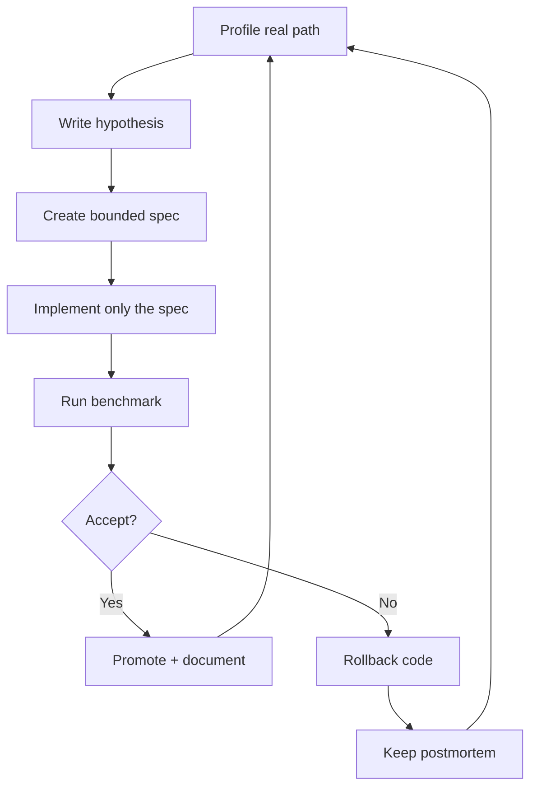

# Technical Discipline

## Why Specs Matter

Performance engineering can become folklore quickly. `sram_attention` uses a
spec-driven optimization loop so that every major change has a clear hypothesis,
test, result, and decision.

## Loop

## Public Spec Shape

Each spec records:

- goal;
- problem;
- scope;
- acceptance criteria;
- benchmark plan;
- result;
- decision.

## Why This Is Investor-Relevant

This reduces execution risk. The team does not only collect wins; it preserves
negative evidence. That matters when pushing against hardware limits, where 90%
of plausible ideas do not survive measurement.

## What We Can Share Publicly

We can share:

- sanitized spec examples;
- benchmark methodology;
- accepted/rejected decision pattern;
- public results.

We do not share:

- proprietary source code;
- model artifacts;
- private customer workloads;
- unpublished implementation details.

