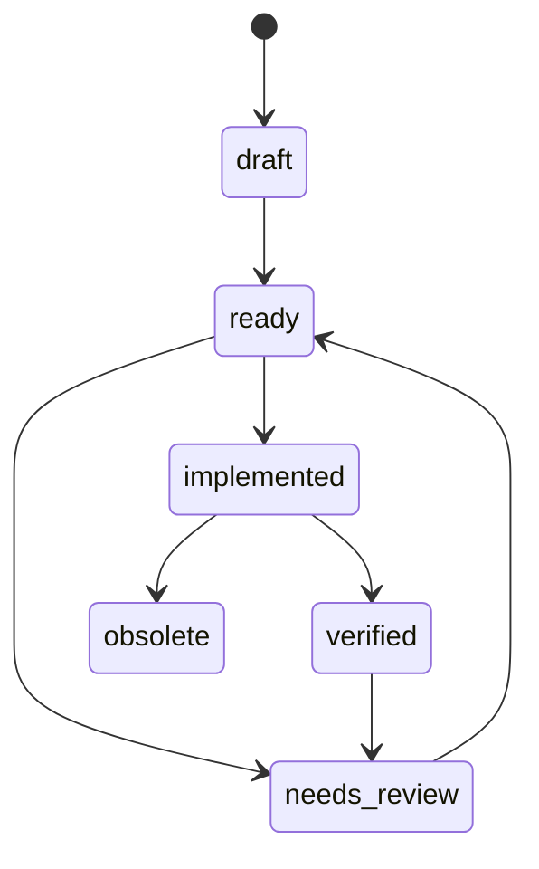

# Public Spec Samples

The engineering repo uses spec-driven optimization. This public folder contains
sanitized examples that show the discipline without exposing implementation
details.

## Spec Lifecycle

## Why Include Specs In A Pitch Repo?

Because performance claims are cheap. Discipline is not.

The samples show how the project turns ideas into measurable experiments:

- bounded scope;
- acceptance criteria;
- benchmark command shape;
- explicit keep/reject decision;
- postmortem when an idea fails.

## Samples

- [IMPL-001-cloud-arm-autotune.md](public-samples/IMPL-001-cloud-arm-autotune.md)
- [IMPL-002-rest-integration-validity.md](public-samples/IMPL-002-rest-integration-validity.md)
- [IMPL-003-rejected-micro-optimization.md](public-samples/IMPL-003-rejected-micro-optimization.md)

